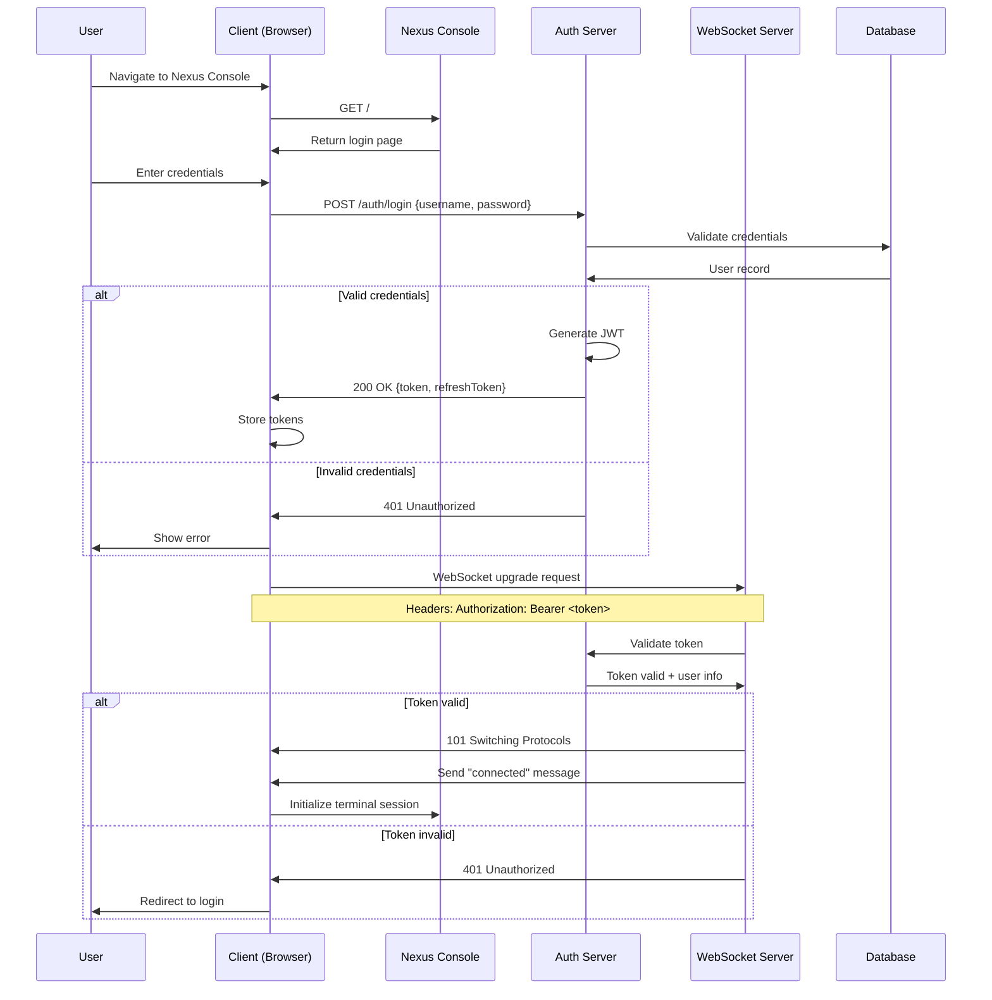
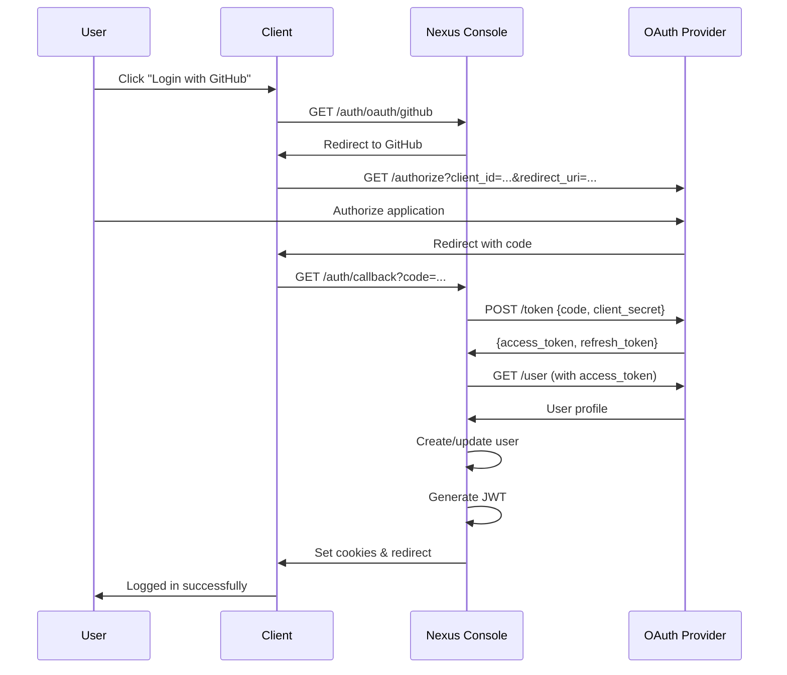
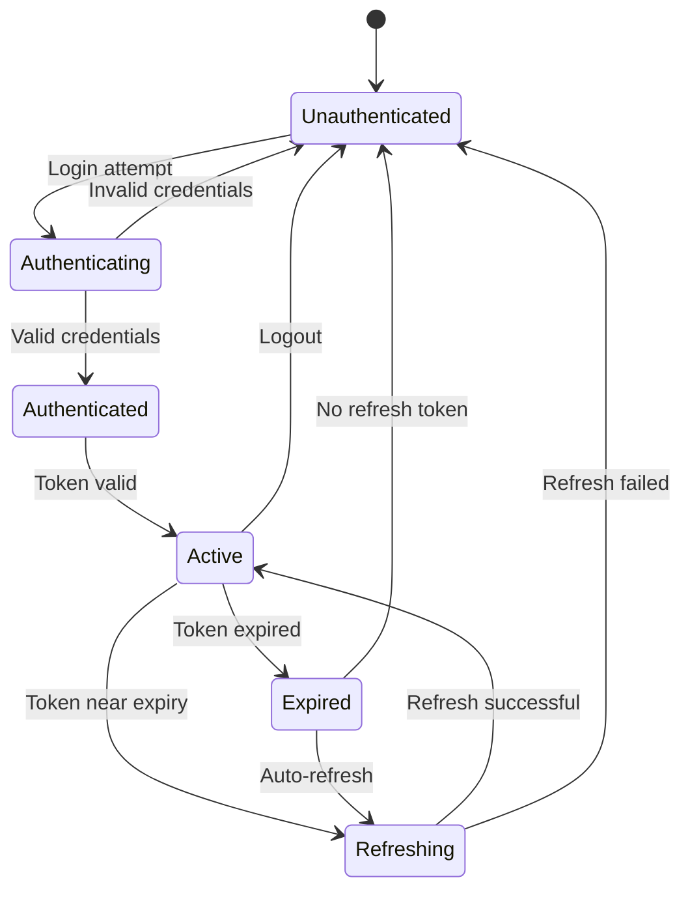

# Authentication Flow Documentation

This document describes the authentication and authorization flows in Nexus Console.

## Overview

Nexus Console implements a secure, token-based authentication system with support for:
- JWT (JSON Web Tokens)
- OAuth 2.0 integration
- API key authentication
- Session management
- Role-based access control (RBAC)

## Authentication Flow Diagram



## OAuth 2.0 Flow



## Token Lifecycle



## Implementation Details

### 1. JWT Token Structure

```typescript
interface JWTPayload {
  // Standard claims
  sub: string;        // User ID
  iat: number;        // Issued at
  exp: number;        // Expiration
  iss: string;        // Issuer
  
  // Custom claims
  username: string;
  email: string;
  roles: string[];
  permissions: string[];
  sessionId: string;
}

// Example token payload
{
  "sub": "user-123",
  "iat": 1704067200,
  "exp": 1704070800, // 1 hour
  "iss": "nexus-console",
  "username": "john.doe",
  "email": "john@example.com",
  "roles": ["user", "admin"],
  "permissions": ["terminal:access", "file:read", "file:write"],
  "sessionId": "sess-abc123"
}
```

### 2. Token Generation

```typescript
import jwt from 'jsonwebtoken';
import { randomBytes } from 'crypto';

export class AuthService {
  private readonly JWT_SECRET = process.env.JWT_SECRET!;
  private readonly JWT_EXPIRES_IN = '1h';
  private readonly REFRESH_EXPIRES_IN = '7d';
  
  generateTokens(user: User): TokenPair {
    const payload: JWTPayload = {
      sub: user.id,
      username: user.username,
      email: user.email,
      roles: user.roles,
      permissions: this.getUserPermissions(user),
      sessionId: this.generateSessionId()
    };
    
    const accessToken = jwt.sign(payload, this.JWT_SECRET, {
      expiresIn: this.JWT_EXPIRES_IN,
      issuer: 'nexus-console'
    });
    
    const refreshToken = jwt.sign(
      { sub: user.id, type: 'refresh' },
      this.JWT_SECRET,
      { expiresIn: this.REFRESH_EXPIRES_IN }
    );
    
    return { accessToken, refreshToken };
  }
  
  private generateSessionId(): string {
    return randomBytes(16).toString('hex');
  }
}
```

### 3. Token Validation

```typescript
export class TokenValidator {
  validateToken(token: string): JWTPayload {
    try {
      const payload = jwt.verify(token, this.JWT_SECRET, {
        issuer: 'nexus-console',
        algorithms: ['HS256']
      }) as JWTPayload;
      
      // Additional validation
      if (!this.isValidSessionId(payload.sessionId)) {
        throw new Error('Invalid session');
      }
      
      return payload;
    } catch (error) {
      if (error.name === 'TokenExpiredError') {
        throw new AuthError('Token expired', 'TOKEN_EXPIRED');
      }
      throw new AuthError('Invalid token', 'INVALID_TOKEN');
    }
  }
  
  private isValidSessionId(sessionId: string): boolean {
    // Check if session exists and is active
    return SessionStore.exists(sessionId);
  }
}
```

### 4. Authentication Middleware

```typescript
export function authMiddleware(
  req: Request,
  res: Response,
  next: NextFunction
): void {
  const token = extractToken(req);
  
  if (!token) {
    return res.status(401).json({ error: 'No token provided' });
  }
  
  try {
    const payload = tokenValidator.validateToken(token);
    req.user = payload;
    next();
  } catch (error) {
    if (error.code === 'TOKEN_EXPIRED') {
      return res.status(401).json({ 
        error: 'Token expired',
        code: 'TOKEN_EXPIRED'
      });
    }
    return res.status(401).json({ error: 'Invalid token' });
  }
}

function extractToken(req: Request): string | null {
  // Check Authorization header
  const authHeader = req.headers.authorization;
  if (authHeader?.startsWith('Bearer ')) {
    return authHeader.substring(7);
  }
  
  // Check cookie
  return req.cookies?.token || null;
}
```

### 5. WebSocket Authentication

```typescript
export class WebSocketAuthenticator {
  async authenticate(ws: WebSocket, req: IncomingMessage): Promise<User> {
    // Extract token from query or headers
    const token = this.extractTokenFromRequest(req);
    
    if (!token) {
      throw new AuthError('No token provided', 'NO_TOKEN');
    }
    
    // Validate token
    const payload = await this.validateToken(token);
    
    // Get user
    const user = await this.userService.findById(payload.sub);
    if (!user) {
      throw new AuthError('User not found', 'USER_NOT_FOUND');
    }
    
    // Check permissions
    if (!this.hasTerminalAccess(user)) {
      throw new AuthError('Insufficient permissions', 'NO_ACCESS');
    }
    
    return user;
  }
  
  private extractTokenFromRequest(req: IncomingMessage): string | null {
    // From Authorization header
    const authHeader = req.headers.authorization;
    if (authHeader?.startsWith('Bearer ')) {
      return authHeader.substring(7);
    }
    
    // From query parameter (for browsers that don't support headers in WS)
    const url = new URL(req.url!, `http://${req.headers.host}`);
    return url.searchParams.get('token');
  }
}
```

## Security Features

### 1. CSRF Protection

```typescript
export class CSRFProtection {
  generateToken(): string {
    return randomBytes(32).toString('hex');
  }
  
  validateToken(token: string, sessionToken: string): boolean {
    return timingSafeEqual(
      Buffer.from(token),
      Buffer.from(sessionToken)
    );
  }
}

// Usage in forms
<form>
  <input type="hidden" name="csrf_token" value="<%= csrfToken %>" />
  <!-- other fields -->
</form>
```

### 2. Rate Limiting

```typescript
export class AuthRateLimiter {
  private attempts = new Map<string, number[]>();
  private readonly MAX_ATTEMPTS = 5;
  private readonly WINDOW_MS = 15 * 60 * 1000; // 15 minutes
  
  checkLimit(identifier: string): boolean {
    const now = Date.now();
    const userAttempts = this.attempts.get(identifier) || [];
    
    // Remove old attempts
    const recentAttempts = userAttempts.filter(
      time => now - time < this.WINDOW_MS
    );
    
    if (recentAttempts.length >= this.MAX_ATTEMPTS) {
      return false; // Rate limit exceeded
    }
    
    recentAttempts.push(now);
    this.attempts.set(identifier, recentAttempts);
    return true;
  }
}
```

### 3. Session Management

```typescript
export class SessionManager {
  private sessions = new Map<string, Session>();
  
  createSession(user: User, metadata: SessionMetadata): Session {
    const session: Session = {
      id: generateSessionId(),
      userId: user.id,
      createdAt: Date.now(),
      lastActivity: Date.now(),
      expiresAt: Date.now() + SESSION_DURATION,
      metadata
    };
    
    this.sessions.set(session.id, session);
    return session;
  }
  
  validateSession(sessionId: string): boolean {
    const session = this.sessions.get(sessionId);
    
    if (!session) {
      return false;
    }
    
    if (Date.now() > session.expiresAt) {
      this.sessions.delete(sessionId);
      return false;
    }
    
    // Update last activity
    session.lastActivity = Date.now();
    return true;
  }
  
  terminateSession(sessionId: string): void {
    const session = this.sessions.get(sessionId);
    if (session) {
      // Clean up resources
      this.onSessionTerminated(session);
      this.sessions.delete(sessionId);
    }
  }
}
```

## Permission System

### 1. Role-Based Access Control

```typescript
export enum Role {
  GUEST = 'guest',
  USER = 'user',
  ADMIN = 'admin',
  SUPER_ADMIN = 'super_admin'
}

export enum Permission {
  // Terminal permissions
  TERMINAL_ACCESS = 'terminal:access',
  TERMINAL_CREATE = 'terminal:create',
  TERMINAL_DELETE = 'terminal:delete',
  
  // File permissions
  FILE_READ = 'file:read',
  FILE_WRITE = 'file:write',
  FILE_DELETE = 'file:delete',
  
  // Admin permissions
  USER_MANAGE = 'user:manage',
  SYSTEM_CONFIG = 'system:config'
}

export const RolePermissions: Record<Role, Permission[]> = {
  [Role.GUEST]: [
    Permission.TERMINAL_ACCESS
  ],
  [Role.USER]: [
    Permission.TERMINAL_ACCESS,
    Permission.TERMINAL_CREATE,
    Permission.FILE_READ
  ],
  [Role.ADMIN]: [
    Permission.TERMINAL_ACCESS,
    Permission.TERMINAL_CREATE,
    Permission.TERMINAL_DELETE,
    Permission.FILE_READ,
    Permission.FILE_WRITE,
    Permission.USER_MANAGE
  ],
  [Role.SUPER_ADMIN]: [
    // All permissions
    ...Object.values(Permission)
  ]
};
```

### 2. Permission Checking

```typescript
export class PermissionChecker {
  hasPermission(user: User, permission: Permission): boolean {
    // Check direct permissions
    if (user.permissions.includes(permission)) {
      return true;
    }
    
    // Check role-based permissions
    for (const role of user.roles) {
      const rolePerms = RolePermissions[role];
      if (rolePerms?.includes(permission)) {
        return true;
      }
    }
    
    return false;
  }
  
  requirePermission(user: User, permission: Permission): void {
    if (!this.hasPermission(user, permission)) {
      throw new AuthError(
        `Missing required permission: ${permission}`,
        'INSUFFICIENT_PERMISSIONS'
      );
    }
  }
}

// Usage in routes
router.delete('/terminal/:id', 
  authMiddleware,
  requirePermission(Permission.TERMINAL_DELETE),
  async (req, res) => {
    // Delete terminal
  }
);
```

## Client-Side Implementation

### 1. Token Storage

```typescript
export class TokenStorage {
  private static readonly TOKEN_KEY = 'nexus_token';
  private static readonly REFRESH_KEY = 'nexus_refresh';
  
  static setTokens(tokens: TokenPair): void {
    // Use httpOnly cookies in production
    if (process.env.NODE_ENV === 'production') {
      // Handled by server-side cookies
      return;
    }
    
    // Development: use sessionStorage
    sessionStorage.setItem(this.TOKEN_KEY, tokens.accessToken);
    sessionStorage.setItem(this.REFRESH_KEY, tokens.refreshToken);
  }
  
  static getAccessToken(): string | null {
    return sessionStorage.getItem(this.TOKEN_KEY);
  }
  
  static clearTokens(): void {
    sessionStorage.removeItem(this.TOKEN_KEY);
    sessionStorage.removeItem(this.REFRESH_KEY);
  }
}
```

### 2. Auto-Refresh

```typescript
export class TokenRefresher {
  private refreshTimer: NodeJS.Timeout | null = null;
  
  startAutoRefresh(expiresIn: number): void {
    // Refresh 5 minutes before expiry
    const refreshTime = (expiresIn - 300) * 1000;
    
    this.refreshTimer = setTimeout(async () => {
      try {
        await this.refreshToken();
      } catch (error) {
        this.onRefreshFailed(error);
      }
    }, refreshTime);
  }
  
  async refreshToken(): Promise<void> {
    const refreshToken = TokenStorage.getRefreshToken();
    if (!refreshToken) {
      throw new Error('No refresh token');
    }
    
    const response = await fetch('/auth/refresh', {
      method: 'POST',
      headers: { 'Content-Type': 'application/json' },
      body: JSON.stringify({ refreshToken })
    });
    
    if (!response.ok) {
      throw new Error('Refresh failed');
    }
    
    const tokens = await response.json();
    TokenStorage.setTokens(tokens);
    
    // Restart auto-refresh
    const payload = this.decodeToken(tokens.accessToken);
    const expiresIn = payload.exp - Math.floor(Date.now() / 1000);
    this.startAutoRefresh(expiresIn);
  }
}
```

### 3. Axios Interceptor

```typescript
import axios from 'axios';

// Request interceptor
axios.interceptors.request.use(
  (config) => {
    const token = TokenStorage.getAccessToken();
    if (token) {
      config.headers.Authorization = `Bearer ${token}`;
    }
    return config;
  },
  (error) => Promise.reject(error)
);

// Response interceptor for token refresh
axios.interceptors.response.use(
  (response) => response,
  async (error) => {
    const originalRequest = error.config;
    
    if (error.response?.status === 401 && !originalRequest._retry) {
      originalRequest._retry = true;
      
      try {
        await tokenRefresher.refreshToken();
        const token = TokenStorage.getAccessToken();
        originalRequest.headers.Authorization = `Bearer ${token}`;
        return axios(originalRequest);
      } catch (refreshError) {
        // Redirect to login
        window.location.href = '/login';
        return Promise.reject(refreshError);
      }
    }
    
    return Promise.reject(error);
  }
);
```

## Security Best Practices

1. **Token Security**
   - Use httpOnly cookies in production
   - Implement CSRF protection
   - Set secure flag for HTTPS
   - Use short token expiration times

2. **Password Security**
   - Use bcrypt with salt rounds >= 10
   - Implement password complexity requirements
   - Support 2FA/MFA
   - Rate limit login attempts

3. **Session Security**
   - Generate cryptographically secure session IDs
   - Implement session timeout
   - Clear sessions on logout
   - Validate session on each request

4. **Transport Security**
   - Always use HTTPS/WSS in production
   - Implement certificate pinning for mobile apps
   - Use secure WebSocket subprotocols

5. **API Security**
   - Validate all input
   - Use parameterized queries
   - Implement proper CORS policies
   - Log security events

## Testing Authentication

```typescript
describe('Authentication', () => {
  test('should authenticate valid user', async () => {
    const response = await request(app)
      .post('/auth/login')
      .send({ username: 'testuser', password: 'testpass' });
    
    expect(response.status).toBe(200);
    expect(response.body).toHaveProperty('token');
    expect(response.body).toHaveProperty('refreshToken');
  });
  
  test('should reject invalid credentials', async () => {
    const response = await request(app)
      .post('/auth/login')
      .send({ username: 'testuser', password: 'wrongpass' });
    
    expect(response.status).toBe(401);
  });
  
  test('should refresh token', async () => {
    const { refreshToken } = await loginUser('testuser', 'testpass');
    
    const response = await request(app)
      .post('/auth/refresh')
      .send({ refreshToken });
    
    expect(response.status).toBe(200);
    expect(response.body).toHaveProperty('token');
  });
});
```

## Troubleshooting

### Common Issues

1. **"Token expired" errors**
   - Check token expiration time
   - Ensure auto-refresh is working
   - Verify server time sync

2. **"Invalid token" errors**
   - Check JWT secret consistency
   - Verify token format
   - Check for token tampering

3. **CORS issues**
   - Configure CORS for auth endpoints
   - Include credentials in requests
   - Check allowed origins

4. **WebSocket auth failures**
   - Ensure token is sent in handshake
   - Check WebSocket subprotocol
   - Verify token validation on server

## Resources

- [JWT.io](https://jwt.io/) - JWT debugger and documentation
- [OAuth 2.0 Specification](https://oauth.net/2/)
- [OWASP Authentication Cheat Sheet](https://cheatsheetseries.owasp.org/cheatsheets/Authentication_Cheat_Sheet.html)
- [WebSocket Security](https://tools.ietf.org/html/rfc6455#section-10)
