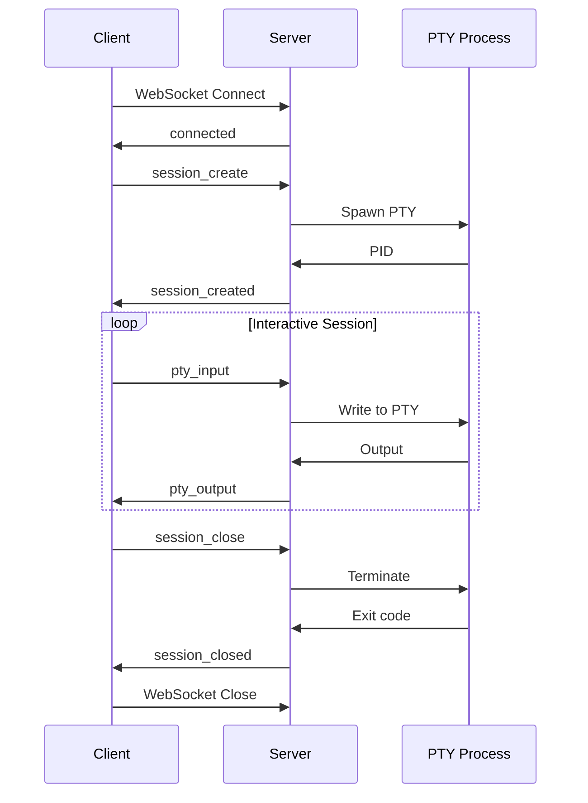
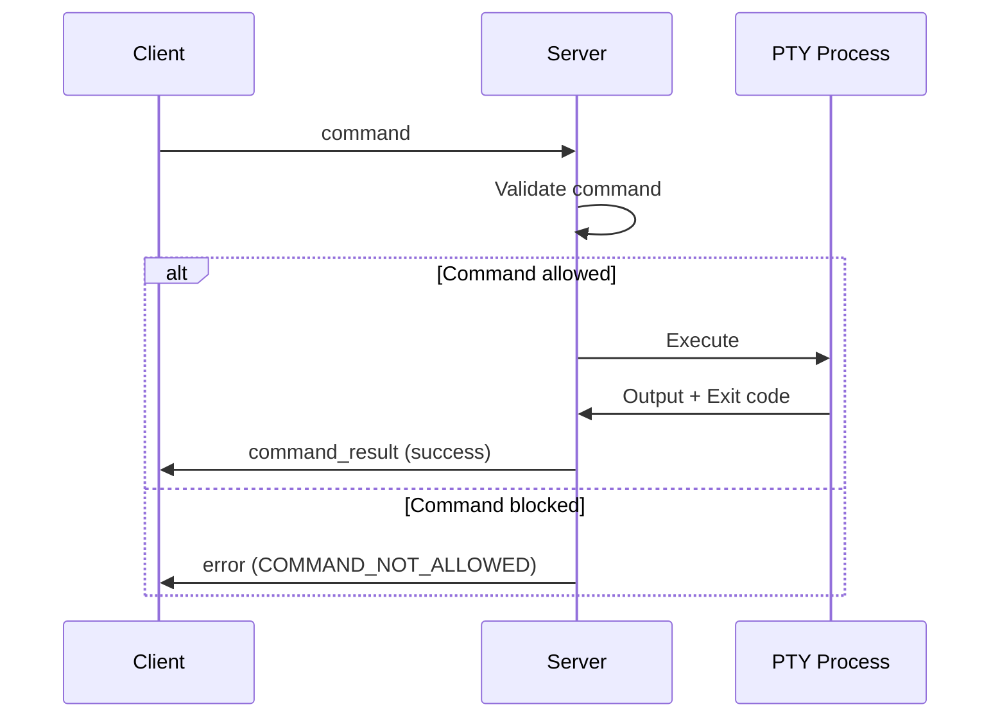

# WebSocket Protocol Documentation

This document describes the WebSocket protocol used by Nexus Console for real-time terminal communication.

## Protocol Overview

- **Version**: 1.0
- **Transport**: WebSocket (RFC 6455)
- **Encoding**: JSON messages with UTF-8 text frames
- **Subprotocol**: `nexus-console-v1`

## Connection Establishment

### 1. WebSocket Handshake

```http
GET /ws HTTP/1.1
Host: localhost:3001
Upgrade: websocket
Connection: Upgrade
Sec-WebSocket-Key: dGhlIHNhbXBsZSBub25jZQ==
Sec-WebSocket-Version: 13
Sec-WebSocket-Protocol: nexus-console-v1
Authorization: Bearer <jwt-token>
X-Client-Version: 1.0.0
```

### 2. Server Response

```http
HTTP/1.1 101 Switching Protocols
Upgrade: websocket
Connection: Upgrade
Sec-WebSocket-Accept: s3pPLMBiTxaQ9kYGzzhZRbK+xOo=
Sec-WebSocket-Protocol: nexus-console-v1
X-Server-Version: 1.0.0
```

### 3. Initial Connection Message

Upon successful connection, the server sends:

```json
{
  "type": "connected",
  "timestamp": 1704067200000,
  "version": "1.0.0",
  "capabilities": [
    "pty",
    "file-transfer",
    "port-forwarding",
    "collaborative-editing"
  ]
}
```

## Message Format

All messages follow this base structure:

```typescript
interface BaseMessage {
  type: string;           // Message type identifier
  timestamp?: number;     // Unix timestamp in milliseconds
  id?: string;           // Optional message ID for request/response correlation
}
```

## Message Types

### Session Management

#### session_create

Client requests a new terminal session:

```json
{
  "type": "session_create",
  "id": "req-123",
  "timestamp": 1704067200000,
  "data": {
    "cols": 80,
    "rows": 24,
    "cwd": "/home/user/project",
    "env": {
      "TERM": "xterm-256color",
      "LANG": "en_US.UTF-8"
    },
    "shell": "/bin/bash"
  }
}
```

#### session_created

Server confirms session creation:

```json
{
  "type": "session_created",
  "id": "req-123",
  "timestamp": 1704067200100,
  "sessionId": "sess-abc123",
  "data": {
    "pid": 12345,
    "shell": "/bin/bash",
    "initialDirectory": "/home/user/project"
  }
}
```

#### session_close

Client requests session termination:

```json
{
  "type": "session_close",
  "sessionId": "sess-abc123",
  "timestamp": 1704067200000
}
```

#### session_closed

Server confirms session closure:

```json
{
  "type": "session_closed",
  "sessionId": "sess-abc123",
  "timestamp": 1704067200100,
  "exitCode": 0,
  "signal": null
}
```

### PTY Communication

#### pty_input

Client sends input to terminal:

```json
{
  "type": "pty_input",
  "sessionId": "sess-abc123",
  "data": "ls -la\n",
  "timestamp": 1704067200000
}
```

#### pty_output

Server sends terminal output:

```json
{
  "type": "pty_output",
  "sessionId": "sess-abc123",
  "data": "total 48\ndrwxr-xr-x  12 user  staff   384 Jan  1 12:00 .\n",
  "timestamp": 1704067200100
}
```

#### pty_resize

Client notifies terminal resize:

```json
{
  "type": "pty_resize",
  "sessionId": "sess-abc123",
  "cols": 120,
  "rows": 40,
  "timestamp": 1704067200000
}
```

### Command Execution

#### command

Client requests command execution:

```json
{
  "type": "command",
  "id": "cmd-456",
  "sessionId": "sess-abc123",
  "command": "git status",
  "args": [],
  "options": {
    "cwd": "/home/user/project",
    "timeout": 30000,
    "env": {
      "GIT_PAGER": "cat"
    }
  },
  "timestamp": 1704067200000
}
```

#### command_result

Server returns command result:

```json
{
  "type": "command_result",
  "id": "cmd-456",
  "sessionId": "sess-abc123",
  "success": true,
  "exitCode": 0,
  "output": "On branch main\nYour branch is up to date...\n",
  "error": "",
  "duration": 150,
  "timestamp": 1704067200150
}
```

### File Operations

#### file_read

Client requests file content:

```json
{
  "type": "file_read",
  "id": "file-789",
  "sessionId": "sess-abc123",
  "path": "/home/user/project/README.md",
  "encoding": "utf8",
  "timestamp": 1704067200000
}
```

#### file_content

Server returns file content:

```json
{
  "type": "file_content",
  "id": "file-789",
  "sessionId": "sess-abc123",
  "path": "/home/user/project/README.md",
  "content": "# My Project\n\nThis is a sample project...\n",
  "encoding": "utf8",
  "size": 1024,
  "mtime": "2024-01-01T12:00:00Z",
  "timestamp": 1704067200100
}
```

#### file_write

Client writes file content:

```json
{
  "type": "file_write",
  "id": "write-012",
  "sessionId": "sess-abc123",
  "path": "/home/user/project/newfile.txt",
  "content": "Hello, World!\n",
  "encoding": "utf8",
  "mode": "0644",
  "timestamp": 1704067200000
}
```

### Control Messages

#### ping

Client keepalive:

```json
{
  "type": "ping",
  "timestamp": 1704067200000
}
```

#### pong

Server keepalive response:

```json
{
  "type": "pong",
  "timestamp": 1704067200050,
  "latency": 50
}
```

#### error

Server error notification:

```json
{
  "type": "error",
  "code": "SESSION_NOT_FOUND",
  "message": "Session sess-xyz not found",
  "details": {
    "sessionId": "sess-xyz",
    "availableSessions": ["sess-abc123"]
  },
  "timestamp": 1704067200000
}
```

## Error Codes

| Code | Description | Recoverable |
|------|-------------|-------------|
| `AUTH_FAILED` | Authentication failure | No |
| `SESSION_NOT_FOUND` | Invalid session ID | Yes |
| `SESSION_LIMIT` | Max sessions reached | Yes |
| `COMMAND_NOT_ALLOWED` | Command blocked by policy | Yes |
| `PATH_NOT_ALLOWED` | Path access denied | Yes |
| `RATE_LIMIT` | Too many requests | Yes |
| `INVALID_MESSAGE` | Malformed message | Yes |
| `INTERNAL_ERROR` | Server error | Maybe |
| `CONNECTION_CLOSED` | Unexpected disconnect | Yes |

## Flow Diagrams

### Session Lifecycle



### Command Execution



## Security Considerations

### Authentication

1. **JWT Token**: Required in Authorization header
2. **Token Expiry**: Tokens expire after 1 hour
3. **Refresh**: Use refresh endpoint before expiry

### Message Validation

1. **Size Limits**: Max message size is 1MB
2. **Rate Limiting**: 100 messages per minute per session
3. **Command Sanitization**: All commands are sanitized
4. **Path Validation**: File paths are restricted

### Encryption

1. **TLS Required**: Production must use WSS
2. **Certificate Pinning**: Optional for enhanced security

## Client Implementation

### TypeScript Example

```typescript
import { WebSocket } from 'ws';

class NexusConsoleClient {
  private ws: WebSocket;
  private sessionId: string | null = null;
  
  constructor(private url: string, private token: string) {}
  
  async connect(): Promise<void> {
    return new Promise((resolve, reject) => {
      this.ws = new WebSocket(this.url, {
        headers: {
          'Authorization': `Bearer ${this.token}`,
        },
        protocol: 'nexus-console-v1',
      });
      
      this.ws.on('open', () => {
        console.log('Connected');
        resolve();
      });
      
      this.ws.on('message', (data: string) => {
        const message = JSON.parse(data);
        this.handleMessage(message);
      });
      
      this.ws.on('error', reject);
    });
  }
  
  async createSession(cols: number, rows: number): Promise<string> {
    return new Promise((resolve) => {
      const id = `req-${Date.now()}`;
      
      this.once('session_created', (msg) => {
        if (msg.id === id) {
          this.sessionId = msg.sessionId;
          resolve(msg.sessionId);
        }
      });
      
      this.send({
        type: 'session_create',
        id,
        data: { cols, rows },
      });
    });
  }
  
  sendInput(data: string): void {
    if (!this.sessionId) throw new Error('No active session');
    
    this.send({
      type: 'pty_input',
      sessionId: this.sessionId,
      data,
    });
  }
  
  private send(message: any): void {
    this.ws.send(JSON.stringify({
      ...message,
      timestamp: Date.now(),
    }));
  }
  
  private handleMessage(message: any): void {
    switch (message.type) {
      case 'pty_output':
        this.emit('output', message.data);
        break;
      case 'error':
        this.emit('error', new Error(message.message));
        break;
      // ... handle other message types
    }
  }
}
```

## Server Implementation

### Message Handler Pattern

```typescript
interface MessageHandler {
  canHandle(message: ConsoleMessage): boolean;
  handle(message: ConsoleMessage, session: Session): Promise<void>;
}

class PTYInputHandler implements MessageHandler {
  canHandle(message: ConsoleMessage): boolean {
    return message.type === 'pty_input';
  }
  
  async handle(message: PTYMessage, session: Session): Promise<void> {
    const pty = session.getPTY();
    if (!pty) {
      throw new Error('No PTY for session');
    }
    
    // Sanitize input
    const sanitized = this.sanitizer.sanitize(message.data);
    
    // Write to PTY
    pty.write(sanitized);
  }
}
```

## Performance Optimization

### Message Batching

For high-frequency output, messages can be batched:

```json
{
  "type": "pty_output_batch",
  "sessionId": "sess-abc123",
  "messages": [
    { "data": "Line 1\n", "timestamp": 1704067200100 },
    { "data": "Line 2\n", "timestamp": 1704067200101 },
    { "data": "Line 3\n", "timestamp": 1704067200102 }
  ],
  "timestamp": 1704067200102
}
```

### Binary Mode

For binary data transfer, use base64 encoding:

```json
{
  "type": "pty_output",
  "sessionId": "sess-abc123",
  "data": "SGVsbG8gV29ybGQh",
  "encoding": "base64",
  "timestamp": 1704067200000
}
```

## Backward Compatibility

The protocol version is included in:
1. WebSocket subprotocol: `nexus-console-v1`
2. Initial `connected` message
3. `X-Server-Version` header

Clients should check version compatibility and handle differences appropriately.

## Extension Points

The protocol can be extended with:
1. Custom message types (prefixed with `x-`)
2. Additional capabilities negotiation
3. Plugin-specific messages

## Testing

### Mock Server

```typescript
import { WebSocketServer } from 'ws';

const mockServer = new WebSocketServer({ port: 8080 });

mockServer.on('connection', (ws) => {
  // Send connected message
  ws.send(JSON.stringify({
    type: 'connected',
    version: '1.0.0',
    timestamp: Date.now(),
  }));
  
  // Echo PTY input as output
  ws.on('message', (data) => {
    const msg = JSON.parse(data.toString());
    
    if (msg.type === 'pty_input') {
      ws.send(JSON.stringify({
        type: 'pty_output',
        sessionId: msg.sessionId,
        data: `echo: ${msg.data}`,
        timestamp: Date.now(),
      }));
    }
  });
});
```

## References

- [RFC 6455 - The WebSocket Protocol](https://tools.ietf.org/html/rfc6455)
- [JSON Schema for Messages](./schemas/console-messages.json)
- [Client SDK Documentation](./api/client.html)
- [Server Implementation Guide](./server-implementation.md)
